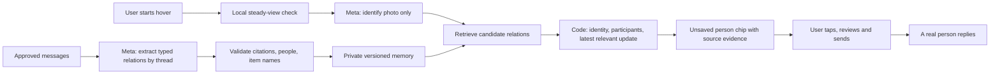

# Prepared relationship memory

Updated September 26, 2026. Current code architecture and clearly labeled earlier measurements. See [the soda scan fix and its measured checks](SODA_SCAN_FIX.md) for the latest targeted review.

**Yes: Callback prepares relationship memory before the camera needs it.** It remembers supported facts from approved messages, not everything about a person. A warm hover scan makes one vision call and zero relationship-extraction calls. Opening the authenticated scanner now starts preparation automatically, while the user gets ready to point the camera.

## Before the moment, then at the moment



**Preparation.** `POST /api/context/prepare` loads the owner's explicitly imported messages. The prototype does not automatically read social or messaging accounts. The configured Meta muse-spark-1.3 memory model extracts items and typed relations such as `inspired`, `prefers`, `wanted`, `planned_together`, `owns`, `dislikes`, and `cancelled`. Every record cites original message IDs and preserves the item's actual words. An `inspired` relation can carry the person's verbatim ambition. A named product preference such as “Diet Coke” stays at exact-title specificity; a taste such as “zero sugar sodas” is category evidence. Original timestamps stay on the source records. The private Supabase `context_indexes` row holds the derived memory; no model training is involved.

For example, fictional messages might yield these records:

| Person | Item copied from source | Relation | Evidence |
|---|---|---|---|
| Friend A | War and Peace | planned_together | “Let's read War and Peace together.” + original message/date |
| Friend B | War and Peace | owns | “I already own War and Peace.” + original message/date |
| Friend A | War and Peace | cancelled | A later explicit cancellation + original message/date |

The table above illustrates a separate shared-plan history. An earlier eight-message synthetic M1/V3 story passed hosted checks with rendered images and scripted replies: *War and Peace* recalled Maya's ambition to “try writing a novel”; coffee recalled her taste for “light-roast whole beans” and avoid words “Dark roasts.” The book-to-pen gift remains unbuilt; the implemented gift path is coffee-to-related-coffee. The approved teammate soda test messages are additional sources and remain in the corpus.

**Recognition.** The browser checks small grayscale frames for steadiness. After roughly 400 ms of a stable, sufficiently detailed view, it sends one photo for recognition. The current configured vision model is Meta muse-spark-1.2, separate from muse-spark-1.3 memory. Before inference, the server rotates and bounds the image to 1024 pixels on its longest edge without enlargement, then encodes JPEG at quality 82; Sharp omits the source metadata. Vision uses `minimal` reasoning and a 1,536-token output cap for Meta. It sees the photo only, not the chat history. It returns a title, edition, category, visible text, specificity, and up to six `visibleItems` whose names are directly confirmed by readable labels. A mixed shelf remains a category image even when individual products can be named. The steady-view check is not an object-recognition model. Rendered-photo success is not physical-phone or venue-lighting proof.

**Retrieval and decision.** Every scan path requires memory matching the current corpus, provider, model, and extraction version; a stale or missing index returns `memory_required` and asks for preparation. There is no per-scan text extraction fallback. The server selects candidate relations and applies deterministic evidence and temporal rules. A broad soda shelf can retrieve named Diet Coke evidence for a possible clarification, but only an explicitly confirmed product name can support an exact named preference. A category or attribute preference can provide a **related** gift reminder; the result marks it `preferenceMatch: related` and must not say the preferred variety is visibly pictured. A confirmed named preference is marked `preferenceMatch: observed`. Buying an item can close a purchase wish while leaving a plan to use it together open. A later cancellation closes that plan. Third-party wishes, unsupported participants, and distinct product variants cannot become an exact personal match. Contact routing uses one owner-scoped query for both matched people and advice contacts.

**Delivery.** The result is a signed, temporary preview. Tapping saves the photo and scan; sending requires another explicit action. The intended social outcome is a welcome invitation and a human reply; earlier hosted checks used scripted replies, so the human exchange still needs a two-phone run. Optional shopping uses the same supported context for friend advice, suitable options, and approved TEST checkout. Native SMS opens the user's texting app; Callback does not confirm delivery there.

## Freshness and reliability

- The cache key hashes owner, full source revision, provider, model, and extraction prompt version (`all-items-v9`). Changing these invalidates the memory.
- Unchanged threads with verified stored relations can be reused. A changed thread is extracted again. Threads that produced zero relations currently lack a saved thread hash and may be reprocessed after an unrelated change.
- On authenticated scanner load, preparation begins once. Starting/stopping hover and inbox polling do not repeatedly initiate preparation. Explicit Refresh/Retry does.
- Demo edits and resets trigger preparation. If an edit finishes during an older build, the browser discards the older response and queues a fresh request. Hover is gated while preparing. A CLI import in an already open session requires Refresh memory or a reload; the server rejects stale hover memory in the meantime.
- Invalid entries trigger bounded corrective extraction retries. An unresolved batch does not publish a partial memory: the invalid entry could be the cancellation needed to suppress an old plan. Validation cannot prove that the model found every relevant message; extraction omissions remain an evaluation concern.
- Preparation supports up to 1,000 sources, batches up to 20 messages/24,000 characters, bounded overlap, six concurrent batches, a 105-second build deadline, and at most 60 extraction attempts. Transport retries can add physical API requests. This is not unlimited or background indexing.
- All scans, including manual, hover, and device scans, read sources from Supabase and validate the current revision/evidence. They do not send those messages through a model at scan time. Missing or stale memory blocks the scan until preparation succeeds.
- A changed memory revision invalidates local previews; opening, sending, and shopping recheck source freshness. A new revision is not silently treated as the old person's valid recommendation.
- Preparation is deduplicated within an instance, but separate server instances can duplicate paid work. A durable job queue and distributed lock would be a later scaling step.

## Earlier preparation and timing work

The stored index, incremental extraction, deterministic rules, and one-call hover path already existed when this earlier pass added automatic early preparation, edit-race handling, batched contact lookups, and separate source/memory/retrieval/decision/contact timings. The paired vision experiment below measured muse-spark-1.3 before the earlier muse-spark-1.1 vision split and the current muse-spark-1.2 configuration. Those earlier results remain historical; they do not measure the present image preparation, prompt, or model configuration.

The timing fields mean:

| Measurement | Scope |
|---|---|
| `sourcesMs`, `memoryMs` | Source loading/revision work and reading/validating stored memory |
| `imagePreparationMs` | Server image decode, orientation, resize, and JPEG encode before the provider call |
| `visionMs` | Vision request serialization, provider/network wait, response read, parsing, and any transport retry; excludes image preparation |
| `relationsMs` | Zero on every prepared scan; scan-time text extraction is gone |
| `retrievalMs`, `decisionMs`, `contactsMs` | Indexed candidate selection, code decision, contact query |
| `assembledMs` | Server time before constructing the result, saving/signing, and final event |
| Terminal event `elapsedMs` | Server stream time through result completion |
| Check-script wall time | Request/upload/response time seen by the script; not camera-to-render time |

The result also includes `visionDiagnostics.image` (original/sent bytes, dimensions, edge limit, preparation time) and `visionDiagnostics.provider` (request bytes, serialization time, and an `attempts` array). Each attempt records `responseHeadersMs`, `responseBodyMs`, `parseMs`, `totalMs`, status, and outcome. `responseHeadersMs` is the wait through response headers: it combines upload, network, provider queue, and inference time, so it is **not** pure model computation. Body timing includes transfer and JSON decoding; parse timing covers the nested model response and schema validation. A retry appears as another attempt, not hidden inside one provider number. Legacy `decidedMs` is cumulative assembly time, not `decisionMs`. Stage values can round to zero milliseconds and do not capture every piece of application overhead.

## Earlier measured vision experiment (muse-spark-1.3)

Eight paired calls used **Meta muse-spark-1.3**, two manufacturer images (Wingspan and Scythe), two repetitions per image, and alternating setting order. Both settings identified all four cases correctly against expected product titles.

| Vision reasoning effort | Correct / calls | Median | Maximum |
|---|---:|---:|---:|
| `low` | 4 / 4 | 5.418 s | 6.713 s |
| `minimal` | 4 / 4 | 4.056 s | 7.388 s |

`minimal` had a roughly 25% lower median in this small historical sample, with a worse maximum. Current code defaults to `minimal` for vision; relationship preparation defaults to `low`. This is two repeated public images, not held-out accuracy, phone latency, or evidence of a dependable speedup. If actual-prop recognition regresses, set `VISION_REASONING_EFFORT=low` and redeploy.

Private experiment report: `data/private/latency/vision-2026-09-26T15-33-40-808Z.json`. Earlier full hosted results are recorded in [HOVER.md](HOVER.md).

The subsequent **earlier** hosted integration run passed **16/16**, but its main preview took **10.053 s** at the client: **9.166 s vision**, **3 ms retrieval**, **2 ms decision**, and **9.386 s server total**. The negative preview took **4.955 s** at the client, with **4.455 s vision**. Both used prepared memory with zero text-model calls. This run showed remote vision dominated latency in that configuration; it is not a measurement of the current muse-spark-1.2 image path.

To repeat on labeled real photos, create a private manifest with image paths relative to that file:

```json
{
  "repeats": 2,
  "cases": [
    {"id": "book-front", "image": "book-front.jpg", "expectedTitle": "War and Peace", "provenance": "Actual demo prop, venue lighting"}
  ]
}
```

Run `npm run vision:latency -- data/private/vision-cases.json`. The harness validates all files before paid calls, compares exact identity, caps the experiment at 24 logical calls, and records errors, denominators, latency, and reported tokens. Provider retries can add requests. It does not write to the app database or send messages. Use `npm run photos:check` separately to evaluate the full person/relation result.

## Research connection: useful, precise claims

FAIR's [Retrieval-Augmented Generation research](https://arxiv.org/abs/2005.11401) combines a model with external retrievable knowledge; its [Meta explanation](https://ai.meta.com/blog/retrieval-augmented-generation-streamlining-the-creation-of-intelligent-natural-language-processing-models/) discusses updating knowledge without retraining. Callback shares that separation of model capability from updateable personal evidence. **We do not implement the original dense-retrieval/sequence-generation RAG model.** Our final person selection is deterministic rather than generated.

The specific engineering idea to explain is **ahead-of-time extraction of typed, source-backed relationships, followed by isolated visual recognition and temporal rule evaluation**. It resembles incremental computation: hash unchanged inputs, reuse valid derived facts, and recompute changed threads. This is an implementation description, not a claim of a new research algorithm.

Meta's [DINOv3](https://github.com/facebookresearch/dinov3) supplies visual feature models; [Faiss](https://github.com/facebookresearch/faiss) supports similarity search over vectors. They could support local candidate retrieval from approved reference images in a larger system. **Neither is installed or used in Callback.** Adding a vector database to the current small typed memory would not eliminate the remote vision call, which is the measured bottleneck. DINO features alone also do not prove a product's title or edition.

For a credible one-to-two-second path, the next experiment is device-side candidate recognition against a small reference set, with abstention and server confirmation for uncertain identities. It needs model/runtime selection, download/device measurements, and evaluation on unseen angles, glare, negative items, and near-identical editions. A provisional suggestion must not authorize an exact purchase or message before confirmation. This remains future work.

## Explain and demonstrate it

> “The moment you see something shouldn't be when an assistant starts reading your entire history. We use Meta to prepare a private memory of shared plans and preferences ahead of time. The camera identifies what's in front of you; code checks which memory is still true and shows the original words. You decide whether to reach out. The result we're after is a person replying.”

Show the ready state before starting hover, the confirmed connection and its original evidence, then a human reply. For a technical follow-up, show `relationsMs: 0`, the source-backed exclusion reasons, and a cancellation that changes the result after rebuilding memory. Keep original source inspection private unless the participants approved sharing it.

The strongest claim is fewer live model calls with explicit evidence and update rules. Do not claim all-knowing memory, instant first recognition, semantic understanding from the revisit cache, original RAG/DINO/Faiss implementation, or completed glasses/XR functionality.

## Code map

- [`knowledge-index.ts`](../src/lib/knowledge-index.ts): extraction, validation, revision keys, thread reuse, and retrieval.
- [`context/prepare/route.ts`](../src/app/api/context/prepare/route.ts): authenticated preparation endpoint.
- [`page.tsx`](../src/app/page.tsx): automatic preparation and edit-race handling.
- [`camera.tsx`](../src/components/camera.tsx): deliberate hover, stability gates, and revisit behavior.
- [`meta.ts`](../src/lib/meta.ts): isolated image recognition and vision effort configuration.
- [`scan-stream.ts`](../src/lib/scan-stream.ts), [`decision.ts`](../src/lib/decision.ts): warm scan, timings, and deterministic connection rules.
- [`vision-latency.ts`](../scripts/vision-latency.ts), [`hover-check.ts`](../scripts/hover-check.ts): paired vision experiment and hosted integration measurements.
